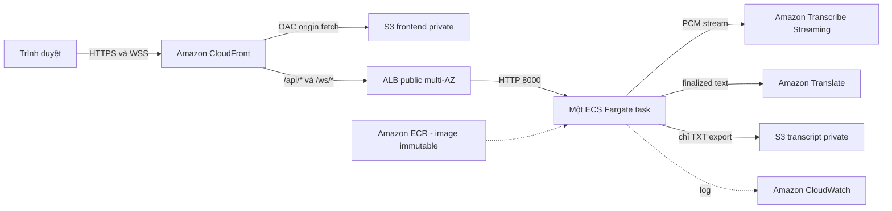

# Tổng quan workshop

## Vấn đề và mục tiêu

Rào cản ngôn ngữ và tốc độ nói nhanh khiến người tham gia khó theo dõi cuộc họp
song ngữ. LiveCap cung cấp phụ đề gần thời gian thực mà không cần tích hợp trực
tiếp với nền tảng họp và không lưu bản ghi microphone.

MVP đã triển khai có thể:

- thu âm từ trình duyệt dưới dạng PCM mono 16 kHz, 16-bit;
- stream audio qua WebSocket bảo mật;
- nhận dạng tiếng Việt và tiếng Anh bằng hai Transcribe stream song song;
- chỉ dịch segment đã finalized và chỉ thêm caption finalized vào giao diện;
- giữ caption finalized khi WebSocket reconnect có giới hạn;
- giới hạn session 30 phút và giới hạn abuse theo process; và
- export transcript song ngữ dạng TXT qua presigned URL của S3.

## Kiến trúc đang chạy đã xác minh

Backend thật chạy tại `ap-southeast-1`. ALB trải trên public subnet thuộc
`ap-southeast-1a` và `ap-southeast-1b`. ECS service duy trì một Fargate task có
public IP trong VPC hiện hữu. ECS có thể thay task lỗi, nhưng đây không phải
active-active; WebSocket đang chạy sẽ mất khi task bị thay thế.

## Dịch vụ và trách nhiệm

| Dịch vụ | Vai trò trong LiveCap |
| --- | --- |
| CloudFront | Entry point HTTPS/WSS công khai và định tuyến theo path |
| Amazon S3 | Origin frontend private và nơi lưu transcript TXT private |
| ALB | Health check và forward API/WebSocket đến port 8000 |
| ECS Fargate | Chạy backend FastAPI dạng container |
| Amazon ECR | Lưu backend image bằng tag immutable từ Git SHA |
| Amazon Transcribe | Chuyển PCM stream thành partial/final text |
| Amazon Translate | Dịch finalized text giữa tiếng Anh và tiếng Việt |
| CloudWatch | Nhận application log và metric dịch vụ AWS |
| GitHub Actions | Chạy CI kiểm tra, không tự deploy |

## Luồng runtime chính

1. CloudFront phục vụ frontend React/Vite từ S3 private qua OAC.
2. Người dùng bấm Start và cấp quyền microphone.
3. Frontend mở `/ws/transcribe` qua CloudFront và ALB.
4. FastAPI kiểm tra giới hạn session toàn hệ thống và theo IP trước khi mở AWS stream.
5. PCM chunk chỉ được gửi khi WebSocket đang mở.
6. Transcribe trả partial/final text; chỉ finalized segment được dịch và thêm vào transcript.
7. Caption song ngữ trả về theo Fargate -> ALB -> CloudFront -> browser.
8. Export ghi object TXT vào S3 private và trả URL tải có thời hạn.

## Hiện tại và target

Repository còn có kiến trúc target đã review trong Terraform: VPC riêng hai AZ,
task private, một NAT Gateway, WAF ở COUNT mode, wake Lambda, ECS scale
`0 <-> 1`, CloudWatch dashboard và AWS Budget. Các phần này vẫn cần reconcile
state, review plan và blue/green cutover trước khi được xem là đã deploy.

